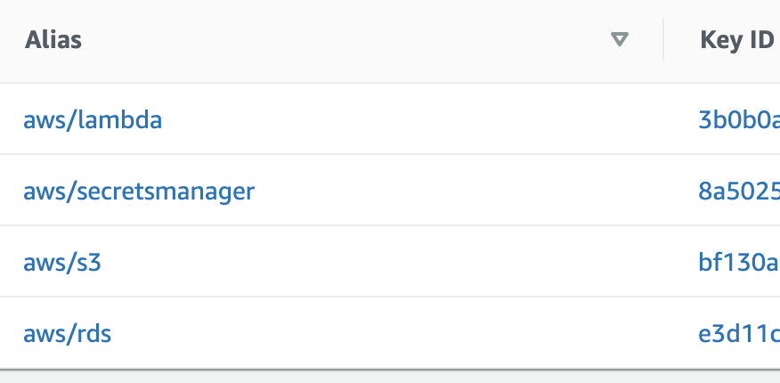

I'm currently studying for AWS Certified Developer: Associate exam and the post you're about to (hopefully!) enjoy is a part of my learning process - learning in public helps me a lot!

## KMS 101

Before we explain what AWS KMS Envelope Encryption is, let's briefly cover KMS itself.

AWS KMS stands for **AWS Key Management Service**. The idea behind the service is that it allows you to "_easily create and control the keys used for cryptographic operations_". Cryptography is a ridiculously difficult area and the more of it we can entrust to someone who knows what they're doing (e.g. AWS KMS team) - the better.

At some point, it may become vital to encrypt some parts of our application: passwords, database credentials, Half Life 3 source code etc. Even if you don't hardcode those credentials in your code (please **don't do that**) and instead inject them via (for example) environment variables, there's still a security risk.

Storing unencrypted database credentials in an unencrypted environment variable does help but it's not perfect. Okay, folks who have access to the git repo won't be able to read those credentials, but whoever has access to the environment variables will be. This poses a huge security risk to some of the teams.

Luckily we can use KMS to encrypt all sorts of data - even entire S3 buckets (and more, last year AWS used KMS in order to encrypt every single DynamoDB table and as you can imagine - that's _lots_ of data).

## Envelope Encryption

How do we encrypt data with KMS? With keys 🗝!

KMS stores keys that are called CMKs (Customer Master Keys). Those keys are used not only to encrypt data but also... other keys 🤯.

You may have already used Customer Master Keys without even knowing it. The reason it happens is when you use any AWS service with encryption, those CMKs are created for you (that's why they're called **AWS-Managed CMKs**). If you want to, you can also use your own Customer-Managed CMKs (e.g. when you want to have a full control over not only the key but its rotation etc.)

**How can I see a CMK?** Well, you can't.

For instance, here's a list of some of CMKs on my account:

**No, I'm not going to show you the full Key ID 😅**

A CMK can be used to encrypt up to 4kB of data. Which is more than enough for a database password, but what about larger amounts of data? That's where the Envelope Encryption comes in.

CMKs can be used to **generate a different set of keys**, called data keys, and those keys can be used to encrypt waaay more than 4kB. There's one more problem though - after generating a data key from a CMK, the KMS service will return it in plaintext (this is by design, btw).

Given a piece of data that we'd like to encrypt, we're going to generate a plaintext data key from a Customer Master Key and use it to encrypt the data. Next, we're going to use the Customer Master Key (remember, we don't have access to it) to **encrypt the data key**.

This image from KMS docs is useful for understanding the concept:

In essence, the encrypted data is wrapped (like an envelope!) with a data key which is then wrapper by yet another (master) key. This _could_ go forever (keys encrypting keys, turtles all the way down) but in order for it to be actually useful, it has to stop _somewhere_. That's why at the end of this chain there's always Customer Master Key which is managed by AWS in a highly, highly secure way.

If you'd like to learn more about KMS, [this video](https://www.youtube.com/watch?v=eIvbUU8VH30) is a good explanation of encrypting data with AWS KMS
