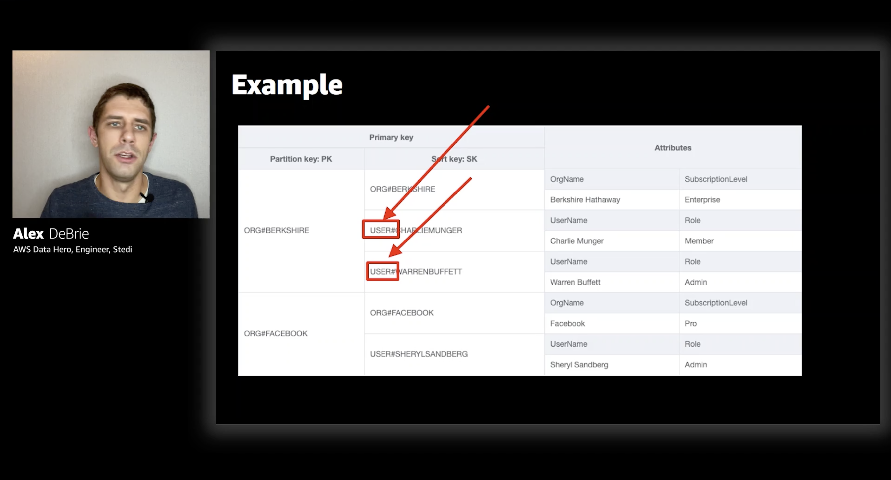
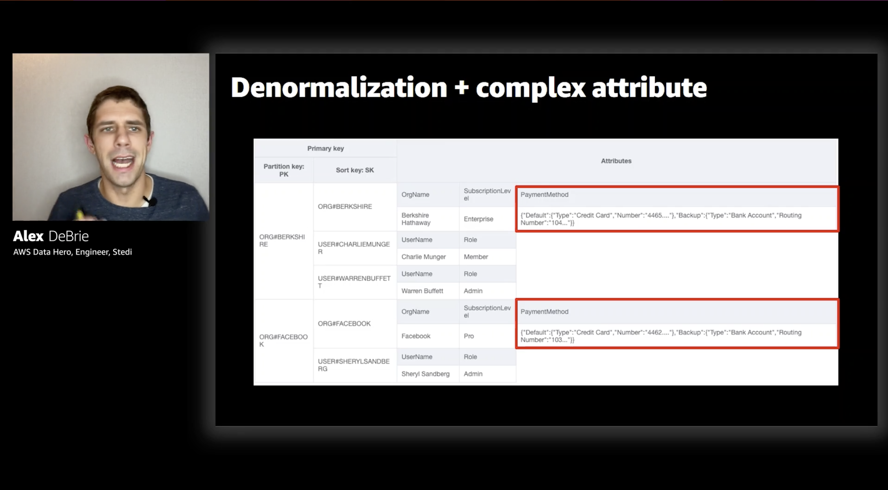
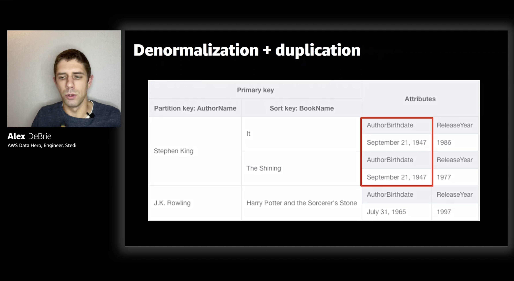
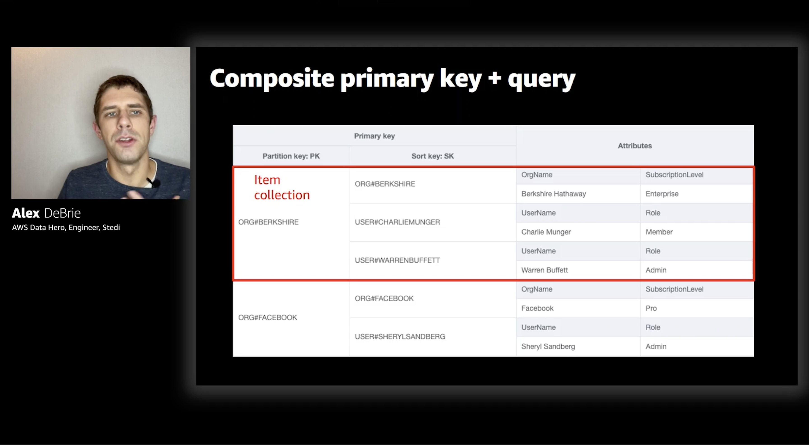

# Notes from Data modeling with Amazon DynamoDB – Part 1 with Alex DeBrie

## DynamoDB basics:
- Table
- Item
- Primary Key
- Attributes

- Table - a collection of data (similar to a table in a relational database)
- Item - an individual record in a DynamoDB table (similar to a row in a relational database)
- Primary Key - whenever you create a DynamoDB table you need to specify a primary key and each item in a table needs to be uniquely identified by that key
- Attributes - additional fields on an Item (other than the primary key). You don't need to declare them in advance, in that sense DynamoDB is schemaless (as in - it's not going to enforce any pre-defined schema). Attributes can either be simple (strings, numbers etc.) or complex (lists, collections, sets).

## Primary key
There are two types of primary keys:

- Simple primary key (partition key)
- Composite primary key (partition key + sort key)

Primary key has to uniquely identify an item so when using composite primary key it's possible (in fact - it happens very often) that there are going to be multiple items with the same partition key (but they will be uniquely identifable by combination of partition key + sort key)

DynamoDB's guiding principle:
**Don't allow operations that won't scale**

## From SQL to NoSQL
- primary key is hugely important (almost all of your access patterns will be based off primary keys, we don't query with attributes)
- There are no joins in DynamoDB 🙀
- Knowing your access paterns is advance is hugely important when working with DynamoDB
- Secondary indexes are necessary for multiple access patterns (since a single partition + sort key is not going to be enough for ensuring a large range of potential access patterns)
- Whenever we create a secondary index data from base table is copied into secondary index with new primary key. They can be used for read-based operations (no writes)

## Single table design:

**All entities in one table + generic primary keys**

Partition/sort keys no longer have meaningful names like "Organization" or "Author", instead we use generic **PK** and **SK**. 

Example:

As we can see in the example - items that share the same partition key (but **not the sort key**) are going to have different attributes (because for instance - *user* and *organization* are going to have different attributes associated with them)

## One-to-many relationships:

Example: an office may have multiple employees, a customer can have multiple orders etc.

Key problem: *how to get information about parent item when fetching related item(s)*

There are multiple strategies when it comes to handling one-to-many relationships in DynamoDB.

### Denormalization + complex attribute:

Good when:
- no access pattern on related items directly
- limited number of related items (400kB - DynamoDB item size limit)

### Denormalization + duplication

This is something you would **never** do in a relational database - duplicate fields from *Author* field to *Book*

Good when:
- Duplicated data is immutable (e.g. birthday), OR
- Duplicated data doesn't change often or is not replicated much

### Composite primary key + query

Querying all items in DynamoDB with the same primary key is **really** fast - in essence it's a O(1) hash table lookup operation (since all those items are going to share the same partition).

All items with the same primary key are referred to as an **Item collection:**

With an item collection we're "pre-joining" data.