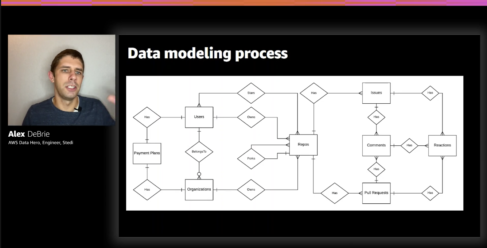
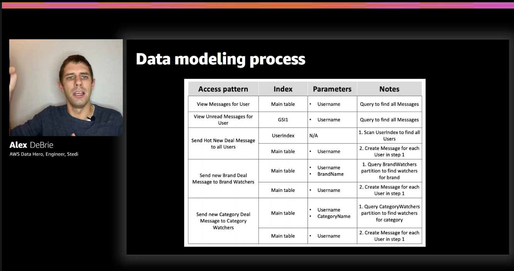
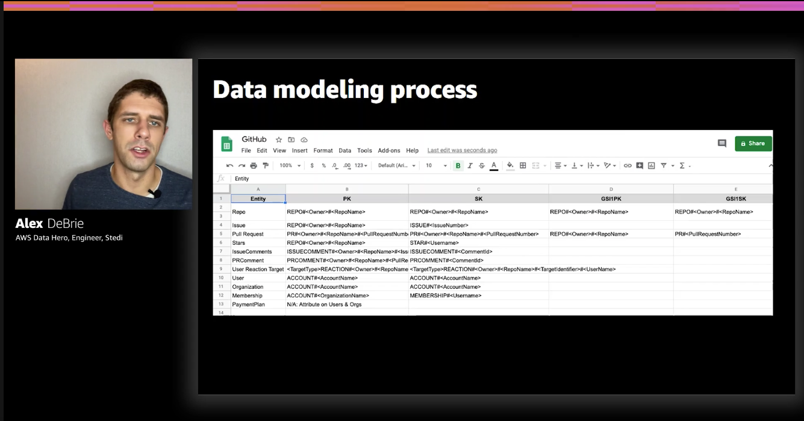
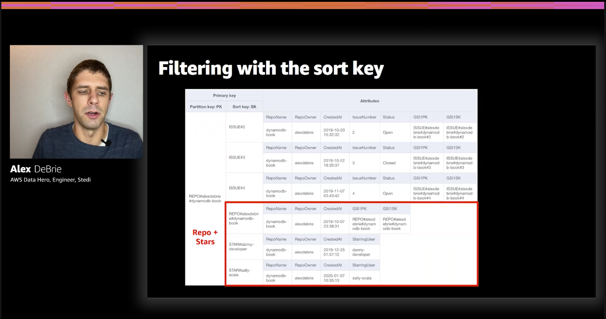
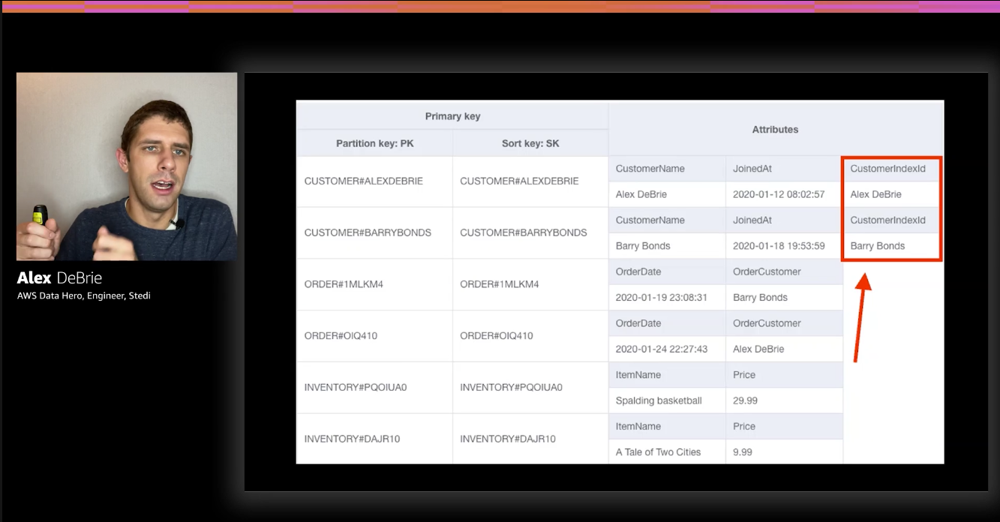

Check out the notes from part 1 [here](https://tlakomy.com/notes-from-data-modeling-with-dynamodb-part-1)

### Data modeling process

**Understand your application**

First of all, make sure you really **understand your application.** This is true for both relational and non-relational databases, in order to model data properly you need to have a deep understanding of your application and business domain. If you feel like there are some gaps in your knowledge, consider talking to a Product Manager, Team Leader or whoever can help you understand the application better (this is true outside of data modeling process as well).

### Create your entity-relationship diagram (ERD)

Next, create an **entity-relationship diagram (ERD)** which maps different objects in your application and how they relate to each other.



In relational databases each one of those boxes (Users, Organizations etc.) becomes a table and the relationship between them is mapped with foreign keys etc. and all is left is to write proper queries. With DynamoDB, things are a bit different, because we need to list our access patterns.

### List your access patterns

Proper data modeling in DynamoDB requires us to think about access patterns up front and it's useful to write them down as a part of the data modeling process.

Example from [The DynamoDB Book](https://www.dynamodbbook.com/):

**Messages sample access patterns:**
- View Messages for User
- View Unread Messages for User
- Send Hot New Deal Message to all Users
- Send new Brand Deal Message to Brand Watchers
- Send new Category Deal Message to Category Watchers

Next, design your table to handle your access patterns

### Design your table to handle your access patterns

Example of an **access pattern chart:**



As we can see this chart maps all of our access patterns to indexes and parameters that are going to be involved in order to satisfy a given access pattern.

Another artifact that might be an output of data modeling process is the **entity chart**. Since we're going to use a single table design to store all of those entities it's useful to understand what PK (Primary Key) and SK (Sort Key) we'll be able to use to access different entity types (e.g. Users, Organizations etc.)



### Know your strategies - part 1: Filtering strategies

>I think that filtering is the most important part of a database.

DynamoDB is a NoSQL database so we cannot use `WHERE` like in a relational DB:

```sql
SELECT *
FROM orders
JOIN users on orders.user_id = users.id
WHERE users.username = 'tlakomy'
```

😢

In DynamoDB **almost all filtering happens with primary keys.**

#### Filtering with the partition key

Given a proper partition key (e.g. `Partition key: Actor`) it's very easy (and efficient!) to execute a query that will return all movies with Tom Hanks.

#### Filtering with the sort key

Sort key is sorted 🤯.

2 patterns:
- **Sort key itself has meaning** (e.g. a timestamp)
- **Sort key has meaning based on how you've modeled it**

Example of filtering with the sort key (taken from [The DynamoDB Book](https://www.dynamodbbook.com/)):



In this example, we're satisfying a "gimmie a repo and all of its stars" access pattern.

#### Sparse index

To recap: in DynamoDB we can create a secondary index that will copy all the data from primary index, but there's a catch:

**Only items that have all elements of a secondary index primary key will be copied**

That fact can be used to create a **sparse index** - an index containing a filtered out list of the items that have all elements of a secondary index primary key.

2 strategies for sparse indexes:
- **Filtering within entity type based on condition**
  - The same secondary index can be used to satisfy multiple additional access patterns (e.g filtering users from an organization with an *Admin* role)
- **Projecting a single type of entity into a secondary index**

Example of a sparse index: 



Notice how querying with that secondary index will return **only** the customers, and not the order, inventory items or anything else that might be in that table.

#### Client-side filtering

- Filtering in backend server or on frontend
- Good when:
  - Filtering is difficult to model in the database
  - Dataset isn't that big (not your **whole** database, but only the fields returned by a given query. Sometimes it's not worth it to overengineer on the database side, filtering on frontend side will solve that problem). Example - filtering all comedy movies by a given actor, you're not likely to return thousands of movies for *"give me all movies starring Tom Hanks"* query


### Sorting strategies

#### Basics of sorting:

- In DynamoDB **only the sort key is sorted** (within a given partition key)
- Sorting is done on an UTF-8 basis:
  - Alphabetical
  - Uppercase before lowercase
  - Numbers and symbols
- Sorting with timestamps
  - Epoch or ISO-8601 works; ISO-8601 is human readable (both of them are sortable 👍)
- Unique, sortable IDs
  - use [ULID](https://github.com/ulid/spec) or [KSUID](https://github.com/segmentio/ksuid) ids

#### Sorting on changing attributes

- Changing a primary key requires `delete` + `put` (that's why you don't want to have a changing attribute - e.g. an `updatedAt` in a primary (partition + sort) key)
- Use secondary index, if possible
- Ascending vs. descending
  - Use `ScanIndexForward` property
  - When modeling, important when combining multiple entity types in single item collection