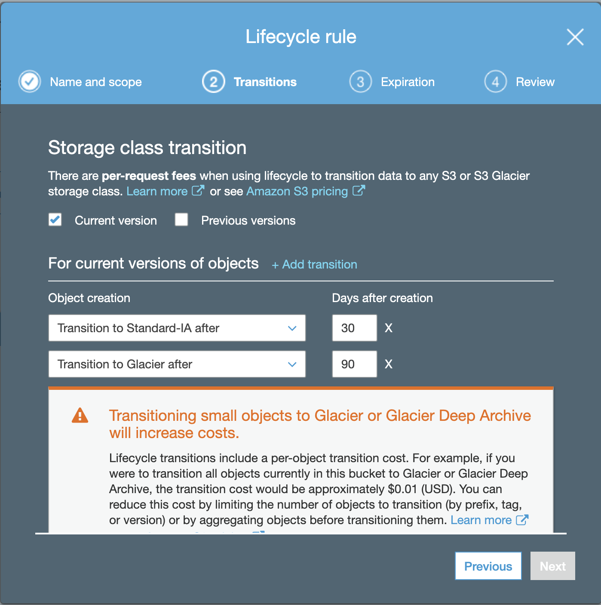
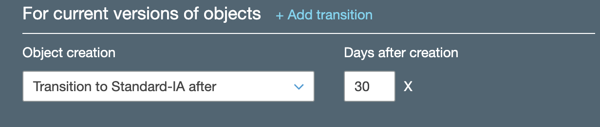
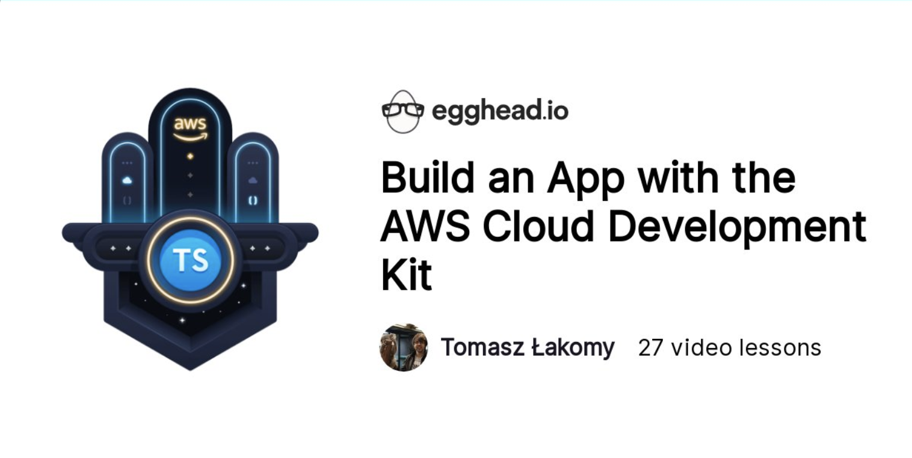

## S3 lifecycle policies with CDK

Imagine a following scenario:

You've been hired at a social media website (e.g. Twitter for Bunnies) and your task is to optimize the way they store their images. Whenever a user uploads a new image, it typically gets accessed quite frequently for a month or so before it fades into obscurity. After ~3 months the images are rarely (if at all) accessed.

The following requirements could be described as:

-   once the image is uploaded, store it in frequent access storage tier (S3 Standard)
-   after a month, change it to an infrequent accesse
-   after a quarter, archive the image for legal reasons

Sure, you could do that manually (good luck with that), write a Python script or - write a couple of lines of TypeScript with CDK.

In order to do that, add a `lifecycleRules` array to a `s3.Bucket` definition as follows:

```ts
const myBucket = new s3.Bucket(this, 'BuckyMcBucketface', {
    lifecycleRules: [
        {
            transitions: [
                {
                    storageClass: s3.StorageClass.INFREQUENT_ACCESS,
                    transitionAfter: cdk.Duration.days(30),
                },
                {
                    storageClass: s3.StorageClass.GLACIER,
                    transitionAfter: cdk.Duration.days(90),
                },
            ],
        },
    ],
});
```

As we can see, `lifecycleRules` takes an array of rules - in our case we specify two `transitions`:

-   after 30 days (notice the use of `cdk.Duration`, much more convienent than having to e.g. specify 30 days in milliseconds) transition the data from S3 Standard (the default storage class) to S3 Standard-IA
-   after 90 days, transition the data to Glacier to save money on storage

**Note:**
🚨 files **must** be stored in a S3 Standard/Standard-IA for at least 30 days before triggering a transition, if we've tried to deploy a stack with a `transitionAfter: cdk.Duration.days(5)`, we'd get an error during the deployment:
`Days' in Transition action must be greater than or equal to 30 for storageClass 'STANDARD_IA'`

Let's run `cdk deploy` and check out the results in S3 Console by clicking on _Management_ tab - our lifecycle rule has been successfuly created 🎉

Select the lifecycle rule and click on **Edit** to review it:



Nice, the lifecycle rule that we've specified with CDK has been applied to our bucket. Files will be transitioned to Standard-IA after 30 days and then to Glacier after 90 days.

Lifecycle rules are not immutable, notice that we're getting a warning that "_Transitioning small objects to Glacier or Glacier Deep Archive will increase costs._". In our case it's exactly \$0.01, but since we don't **actually** need to move those files to Glacier after a quarter, let's go back to the CDK stack and remove that rule.

```ts
const myBucket = new s3.Bucket(this, 'BuckyMcBucketface', {
    lifecycleRules: [
        {
            transitions: [
                {
                    storageClass: s3.StorageClass.INFREQUENT_ACCESS,
                    transitionAfter: cdk.Duration.days(30),
                },
            ],
        },
    ],
});
```

Before we hit deploy, let's run `cdk diff` to see how the change in a lifecycle rule will be applied:

```bash
Stack AmazonS3Stack
Resources
[~] AWS::S3::Bucket BuckyMcBucketface BuckyMcBucketface22FEAF1D
 └─ [~] LifecycleConfiguration
     └─ [~] .Rules:
         └─ @@ -5,10 +5,6 @@
            [ ]     {
            [ ]       "StorageClass": "STANDARD_IA",
            [ ]       "TransitionInDays": 30
            [-]     },
            [-]     {
            [-]       "StorageClass": "GLACIER",
            [-]       "TransitionInDays": 90
            [ ]     }
            [ ]   ]
            [ ] }
```

As we can see, the lifecycle rule itself won't be deleted, only the Glacier transition part. Let's deploy it with `cdk deploy` and see that the rule has been updated:



Congrats, you've just learned how to manage S3 lifecycle rules with AWS CDK 🎉

# I'd like to learn more about AWS, how do I do that?

Excellent question!

A while ago I've launched an entire AWS course on [egghead.io](https://egghead.io/s/km6vr) - check out [Build an App with the AWS Cloud Development Kit](https://egghead.io/courses/build-an-app-with-the-aws-cloud-development-kit?af=6p5abz)

[](https://egghead.io/courses/build-an-app-with-the-aws-cloud-development-kit?af=6p5abz)

It's the best piece of content I've ever created and I'm incredibly proud of it 🌟

Apart from that, I also have [egghead.io](https://egghead.io/s/km6vr) collections about serverless topics, such as:

-   [Learn AWS Lambda from scratch](https://egghead.io/playlists/learn-aws-lambda-from-scratch-d29d?af=6p5abz)
-   [Learn AWS Serverless Application Model (AWS SAM) from scratch](https://egghead.io/playlists/learn-aws-serverless-application-model-aws-sam-framework-from-scratch-baf9?af=6p5abz)
