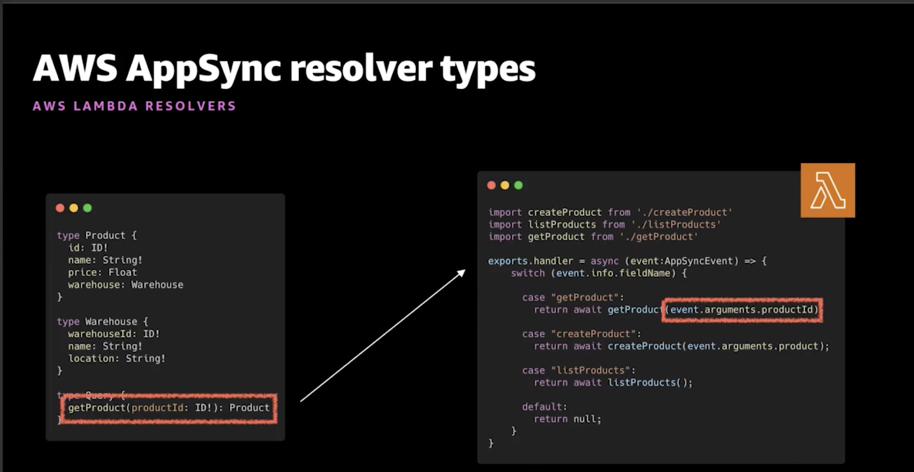

# Notes from AppSync sessions @ Re:Invent 2020

_More like Re:Mote 2020_

**Notes from [Unify access to siloed data with AWS AppSync GraphQL resolvers](https://virtual.awsevents.com/media/1_ov2gbvu6) by [Nader Dabit](https://twitter.com/dabit3)**

## Three types of AppSync Resolvers:
- Direct (directly map a GraphQL operation into a data source - DynamoDB, ElasticSearch or Aurora Serverless)
- Lambda resolvers
- HTTP resolvers

## `$context` object
The `$context` object is a map that holds all of the contextual information for your resolver invocation

`$context` contains:
- `arguments` - a map that contains all GraphQL arguments for this field
- `source` - a map that contains the resolution of the parent field
- `result` - (available only in the response mapping template) a container for the results of this resolver
- `identity` - (available only for authenticated requests) an object that contains information about the caller
- `request` - additional metadata about the request, including the headers
- `info` - (GraphQL specific) an object that contains information about the GraphQL request (e.g. `fieldName`, `variables` passed in to the query etc. and `selectionSetList` - fields that we want to return from a query)

## Lambda resolvers
- The same `context` object is passed to the Lambda function (apart from the result, since we return whatever the Lambda function returns)



## AppSync deployment options:
- AWS Amplify
- AWS CDK
- Serverless framework
- AWS CloudFormation (obviously)

AppSync is well supported with Amplify, there are certain things that are (currently?) only available in Amplify CLI such as Amplify DataStore.

Adding an AppSync API with Amplify CLI is as simple as running `amplify add api`.

Apart from Amplify, we can also use CDK (💙) to provision an AppSync API, as an example:

```ts
import * as appsync from '@aws-cdk/aws-appsync';

const api = new appsync.GraphqlApi(this, 'Api', {
  name: 'my-awesome-appsync-api',
  schema: appsync.Schema.fromAsset(
    path.resolve(__dirname, '../../../schema.graphql'),
  ),
  authorizationConfig: {
    defaultAuthorization: {
      authorizationType: appsync.AuthorizationType.API_KEY,
    },
    // Other authorization types (such as Cognito) are also supported
  },
  xrayEnabled: true,
});

const notesLambda = new lambda.Function(this, 'AppSyncNotesHandler', {
  runtime: lambda.Runtime.NODEJS_12_X,
  handler: 'appsync.handler',
  code: lambda.Code.fromAsset('lambda-fns'),
});

const lambdaDataSource = api.addLambdaDataSource(
  'lambdaDataSource',
  notesLambda,
);
```

Docs: https://docs.aws.amazon.com/cdk/api/latest/docs/aws-appsync-readme.html

In order to define a subscrpiton in a GraphQL schema with AppSync, we need to use `@aws_subscribe` directive e.g.:

```graphql
type Subscription {
  onCreatePost: Post
    @aws_subscribe(mutations: ["createPost"])
}
```

**Notes from [Best practices to securely operate GraphQL at scale with AWS AppSync](https://virtual.awsevents.com/media/1_47rvebii) by [Brice Pellé](https://twitter.com/bricepelle)**

AppSync provides enterprise security features such as:
- AWS WAF
- Auth2 modes
- access controls
- monitoring

## Production-ready GraphQL requirements:

**Protect access:**
- Only authorized access
- Support multiple access patterns

**Protect performance:**
- Monitor constantly
- Analyze in real time
- Improve over time

**Protect availability:**
- Maintain service uptime
- Limit availability to trusted services
- Block bad actors

**Deploy reliably:**
- Infrastructure as code
- Repeatable

Appsync *always* requires some sort of authorization in order to access your API - no anonymous access is allowed.

## AppSync Authorization Modes:
- API key
- OpenID Connect (with JWT)
- Amazon Cognito User Pools (with JWT)
- IAM

It's up to us to choose the right authorization mode to fit the access use case.

### API Key
- Uses HTTP header `x-api-key`
- Hardcoded in application

**When to use:**
- Getting started
- With public APIs
- No specific authorization requirements

## Cognito User Pools
- Sign in with Amazon Cognito User Pools
- Use JWTs

**When to use:**
- Authenticating users in app
- Connecting social identities
- Interacting with other AWS services

Granual access control with AppSync directives:

```graphql
type Query {
  posts:[Post!]!
    @aws_auth(cognito_groups: ["Bloggers", "Readers])
}
```

## OpenID Connect
- Sign in with OIDC idP
- Use JWTs

**When to use:**
- Existing user directory
- Authenticating users in app
- Not interacting with other AWS services

## IAM
- Backend systems
- AWS credentials
- IoT systems

**When to use:**
- Amazon EC2 instances
- AWS Lambda functions

AppSync allows us to use **all those authorization modes at the same times on a single API** 🤯

## Protecting availability of an AppSync API
- AppSync provides DDoS protection for any API that we configure
- AWS WAF (Web Application Firewall) is also supported

## AWS WAF: Use cases with AWS AppSync
- Protect against flooding
- Turn off introspection (make your schema **not discoverable**)
- Support B2B APIs using API key
- Limit access to Amazon VPC resources only

## Protecting performance of an AppSync API
- AppSync supports CloudWatch by default (and CloudWatch metrics/alerts)
- AppSync also integrates with AWS X-Ray
- AppSync Cache

## AppSync Cache

## Caching
- Managed server-side caching
- Full API caching
- Per resolver caching
- Encryption

More info from the docs:
>AWS AppSync’s server-side data caching capabilities reduce the need to directly access data sources by making data available in a high speed in-memory cache, improving performance and decreasing latency.

>AWS AppSync hosts Amazon ElastiCache Redis instances in the AppSync service accounts, in the same AWS Region as your AppSync API.

Caching policies:
- **None** - no server-side caching (no shit)
- **Full request caching** - If the data is not in the cache, it will be retrieved from the data source and populate the cache until the TTL expiration. All subsequent requests to your API will be returned from the cache, which means data sources won’t be contacted directly unless the TTL expires.
- **Per-resolver caching** - With this setting, each resolver needs to be opted in explicitly for it to cache responses. A TTL and caching keys can be specified on the resolver. 

Cache encryption:
- **Encryption in transit** - requests between AppSync, the cache, and data sources (except insecure HTTP data sources) will be encrypted at the network level. Because there is some processing needed to encrypt and decrypt the data at the endpoints, enabling in-transit encryption can have some performance impact.
- **Encryption at rest** - Data saved to disk from memory during swap operations will be encrypted at the cache instance. This setting also carries a performance impact.
