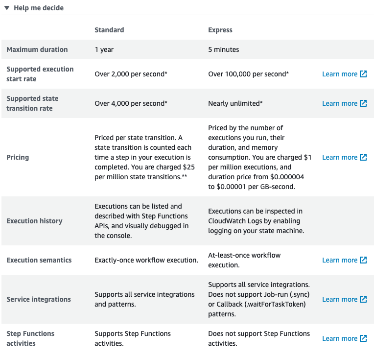

Notes from https://theburningmonk.thinkific.com/courses/take/complete-guide-to-aws-step-functions

- Define the steps of your workflow in the JSON-based Amazon States Language
- With AWS Step Functions, you pay only for the transition from one step of your application workflow to the next, called a state transition. Billing is metered by state transition, regardless of how long each state persists (up to one year).

## State types:
- **Task state** - performs a task (e.g. calls a Lambda function identified by its ARN). Can specify an optional timeout which defaults to 60s, even if fuction has a longer timeout (it's a good idea to set this timeout to match your function's timeout)
- **Pass state** - passes its input to its output (without peforming work). Useful when constructing and debugging state machines. Example - modifying the `ResultPath`.
- **Wait state** - delays the state machine from continuing for a specified time (either a specific interval e.g. 5 seconds or till a timestamp)
- **Choice state** - adds branching logic to a state machine. Can implement 16 different comparision operators and can be combined using And, Or and Not. It needs to specify a default state which will be applied when none of the choices match.
- **Parallel state** - can be used to create parallel branches of execution in your state machine. Note that if one parallel branch fails, than all the other branches are immediately cancelled.
- **Map state** - 
- **Succeed** - terminates the state machine successfully.
- **Fail** - terminates the state machine and mark it as failure

### Parallel state:
- parallel states can be nested
- you can only transition to another state in the **same** branch
- no duplicate state names in the whole state machine
- outputs from branches are collected into an array
## State machine details
- Name
- IAM permission (either create a new role based on your state machine's definition or use an existing one)
- Logging (CloudWatch charges apply)
- X-Ray tracing (charges apply)
- Tags

- We can execute a state machine with any input

## State machine types
- **Standard** - durable, checkpointed workflows for machine learning, order fulfillment, IT/DevOps automation, ETL jobs and other log-duration workloads.
Pricing:
>Priced per state transition. A state transition is counted each time a step in your execution is completed. You are charged $25 per million state transitions.**	
- **Express** - event-driven workflows for streaming data processing, microservices orchestration, IoT data ingestion, mobile backends and other short duration, high-event-rate workloads. They are cheaper but lack the visual audit capabilities. Since express workflows are event-driven, you cannot set up notifications for e.g. `SUCCEEDED` or `RUNNING` states (otherwise imagine your CloudWatch bill, oh my)
Pricing:
>Priced by the number of executions you run, their duration, and memory consumption. You are charged $1 per million executions, and duration price from $0.000004 to $0.00001 per GB-second.	



## State machine triggers:
- AWS Console
- AWS API (`StepFunction.startExecution(req).promise()`)
- AWS API Gateway (in a fire & forget pattern, API Gateway won't await for a state machine result - it can be a whole year after all)
- CloudWatch Events (including cron)

## Pricing:
- Free tier - 4,000 state transitions per month (note that it does not automatically expire at the end of your 12 month AWS Free Tier term and is available to both existing and new AWS customers indefinitely)
- State transitions - $0.025 per 1000 state transitions (that is - $25 per one million state transitions). It's one of the most expensive services on AWS.

## Managing execution state
- A function recieves the current execution state as input
- A state can also define its `InputPath` so a whole exeuction state does not need to be passed in as an input
- We can map the value returned from a Lambda function to a `ResultPath`, e.g.: `"ResultPath": "$.n"`

## Error handling:
- Each error can be retried separately and has its own retry count
- An error can define an `IntervalSeconds` (the time between retries), `BackoffRate` (multiplier between retries) and `MaxAttempts`
- Note that an error with `MaxAttempts` set to 0 won't be retried
- A state can also define a `Catch` clause which will, well, catch errors once their retry count is over

## Limits:
- Maximum open executions: 1,000,000
- Maximum execution time: 1 year (enough for `npm install`, lmao)
- Maximum execution history size: 25,500 events
- Maximum execution idle time: 1 year
- Maximum execution history retention time: 90 days
- Maximum input to a Task is 32kB (larger inputs should be stored in S3)


# Concepts (source: https://states-language.net/spec.html)

## State:
- are represented as fields of teh top-level "States" object
- name <= 128 characters
- state names must be unique within the whole state machine
- all states must have a "type" field

## Transitions:
- link states together, defining the control flow for the state machine
- after exeuctiing a non-terminal sate, the interpreter follows a transition to the next state
- for most state types those transitions are unconditional and specified through the state's `"Next"` field
- (Note: `"Next"` field must exactly and case-sensitively match the name of the another state)
- All non-terminal states *must* have a `"Next"` field, apart from the Choice State

## Data:
- The interpreter passes data between states to perform calculations or to dynamically control the state machine’s flow. All such data MUST be expressed in JSON.
- When two states are linked by a transition, the output from the first state is passed as input to the second state. 

## Context:
- The interpreter can provide information to an executing state machine about the execution and other implementation details in form of a JSON Context Object

## Paths:
- A Path is a string, beginning with "$", used to identify components with a JSON text.
- The syntax is that of [JsonPath](https://github.com/json-path/JsonPath)
- When a Path begins with `"$$"`, two dollar signs, this signals that it is intended to identify content within the Context Object.
- The operators "@", ",", ":", and "?" are not supported - all Reference Paths MUST be unambiguous references to a single value, array, or object (subtree).

Example, given a state input data:
```json
{
    "foo": 123,
    "bar": ["a", "b", "c"],
    "car": {
        "cdr": true
    }
}
```
Then the following Reference Paths would return:

```
$.foo => 123
$.bar => ["a", "b", "c"]
$.car.cdr => true
```

## Payload template:
- A state machine interpreter dispatches data as input to tasks to do useful work, and receives output back from them. It is frequently desired to reshape input data to meet the format expectations of tasks, and similarly to reshape the output coming back. A JSON object structure called a Payload Template is provided for this purpose.

>To illustrate by example, the Task State has a field named "Parameters" whose value is a Payload Template. Consider the following Task State:

```json
"X": {
  "Type": "Task",
  "Resource": "arn:aws:states:us-east-1:123456789012:task:X",
  "Next": "Y",
  "Parameters": {
    "first": 88,
    "second": 99
  }
}
```

>In this case, the payload is the object with "first" and "second" fields whose values are respectively 88 and 99. No processing needs to be performed and the payload is identical to the Payload Template.

Another example:
```json
"X": {
  "Type": "Task",
  "Resource": "arn:aws:states:us-east-1:123456789012:task:X",
  "Next": "Y",
  "Parameters": {
    "flagged": true,
    "parts": {
      "first.$": "$.vals[0]",
      "last3.$": "$.vals[3:]"
    },
    "weekday.$": "$$.DayOfWeek",
    "formattedOutput.$": "States.Format('Today is {}', $$.DayOfWeek)"
  }
}
```

>Suppose that the input to the P is as follows:

```json
{
  "flagged": 7,
  "vals": [0, 10, 20, 30, 40, 50]
}
```

>Further, suppose that the Context Object is as follows:

```json
{
  "DayOfWeek": "TUESDAY"
}
```
>In this case, the effective input to the code identified in the "Resource" field would be as follows:
```json
{
  "flagged": true,
  "parts": {
    "first": 0,
    "last3": [30, 40, 50]
  },
  "weekday": "TUESDAY",
  "formattedOutput": "Today is TUESDAY"
}
```

## Intrinsic Functions
- The States Language provides a small number of "Intrinsic Functions", constructs which look like functions in programming languages and can be used to help Payload Templates process the data going to and from Task Resources.

## Errors
- Any state can encounter runtime errors. Errors can arise because of state machine definition issues (e.g. the "ResultPath" problem discussed immediately above), task failures (e.g. an exception thrown by a Lambda function) or because of transient issues, such as network partition events.
- When a state reports an error, the default course of action for the interpreter is to fail the whole state machine.
- Whenever a state machine encounteres an error a step can be retried if it was defined in the step Retry field, e.g:

```json
"Retry" : [
    {
      "ErrorEquals": [ "States.Timeout" ], // only timeouts will be retried
      "IntervalSeconds": 3,
      "MaxAttempts": 2,
      "BackoffRate": 1.5
    }
]
```

- Here is an example of a Retrier which will retry any error except for "States.Timeout", using the default retry parameters:

```json
"Retry" : [
    {
      "ErrorEquals": [ "States.Timeout" ],
      "MaxAttempts": 0
    },
    {
      "ErrorEquals": [ "States.ALL" ]
    }
]
```

## Step functions and other AWS Services:

### SNS

- When we're using SNS in a State, its type is still `Task` but the `Resource` is not sent to e.g. a Lambda function or a SNS topic. Instead it's set to a special `arn:aws:states:::sns:publish` resource
- Inside the `Parameters` section we have to provide a `TopicArn` of the SNS topic we'd like to send a message to

Example:
```json
"Send message to SNS": {
  "Type": "Task",
  "Resource": "arn:aws:states:::sns:publish",
  "Parameters": {
    "TopicArn": "arn:aws:sns:us-east-1:ACCOUNT_ID:myTopic",
    "Message": {
      "Input": "Hello from Step Functions!"
    }
  },
  "Next": "NEXT_STATE"
}
```

### SQS

- We can also send messages to an SQS queue using the `Task` state
- Similar to SNS, we need to use a special `arn:aws:states:::sqs:sendMessage` `Resource` and provide a `QueueUrl` in `Parameters`

Example:

```json
"Send message to SQS": {
  "Type": "Task",
  "Resource": "arn:aws:states:::sqs:sendMessage",
  "Parameters": {
    "QueueUrl": "https://sqs.REGION.amazonaws.com/ACCOUNT_ID/myQueue",
    "MessageBody": {
      "Input": "Hello from Step Functions!"
    }
  },
  "Next": "NEXT_STATE"
}
```

## DynamoDB
- Uses a `arn:aws:states:::dynamodb:putItem` resource for `putItem` call, `arn:aws:states:::dynamodb:getItem` for `getItem` call etc.
- It's mandatory to specify a `TableName` in `Parameters`
- Note: a `putItem` call won't return anything, that's why in the course Yan scheduled a `GetDynamoDBItem` state to occur after `PutDynamoDBItem`

Example:

```json
"Get item from DynamoDB": {
  "Type": "Task",
  "Resource": "arn:aws:states:::dynamodb:getItem",
  "Parameters": {
    "TableName": "MyDynamoDBTable",
    "Key": {
      "Column": {
        "S": "MyEntry"
      }
    }
  },
  "Next": "NEXT_STATE"
}
```
## Activities
- We can find them in the Console next to `State machines`
- They are used when we need to wait for external "activities" to complete
- With activites the state machine is no longer fully controlling the flow as it's simply waiting for an activity to complete
- They require a usage of Task Poller
## Callbacks
- They solve a problem with Activities (_"activities kinda suck because you need to run pollers, which is not exactly event driven & serverless"_)
- With callbacks a state machine can send a message e.g. to an SQS queue with a `TaskToken` and ask SQS to notify the state machine when it's done/failed

## Nested workflows
- **fire-and-forget**: a "root" state machine starts another state machine but does not wait for it to complete (and as such we won't know if it succeeded/failed)
- **synchronous**: a "root" state machine starts another state machine and waits for it to complete
- **callback**: using a `TaskToken`