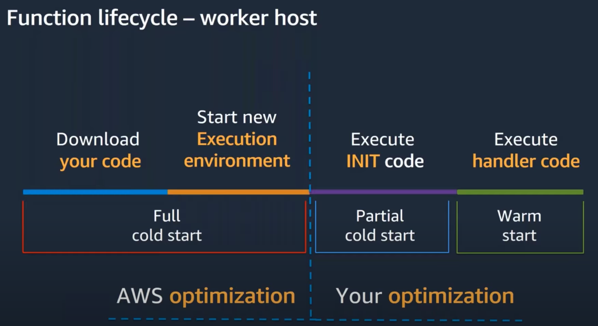
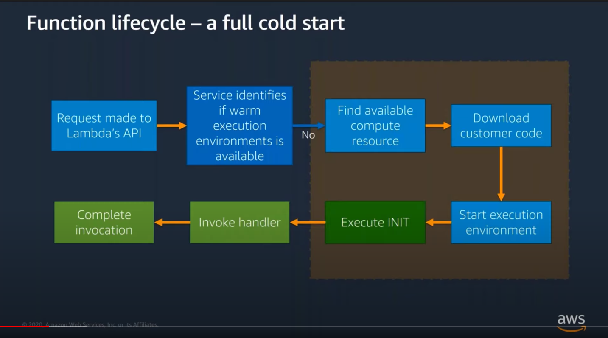
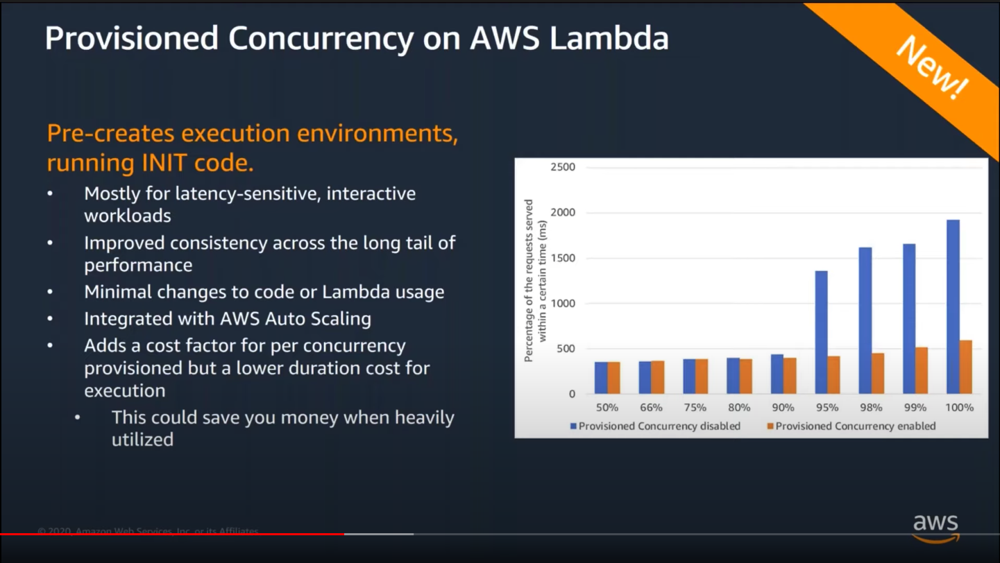
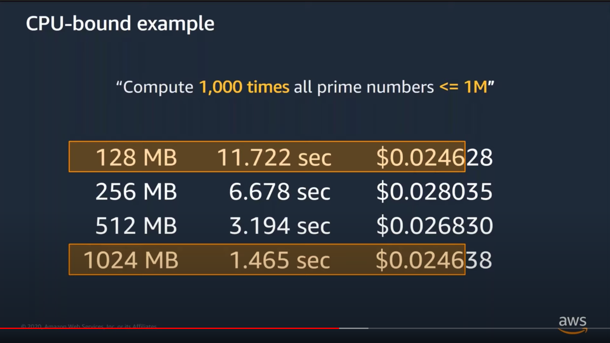
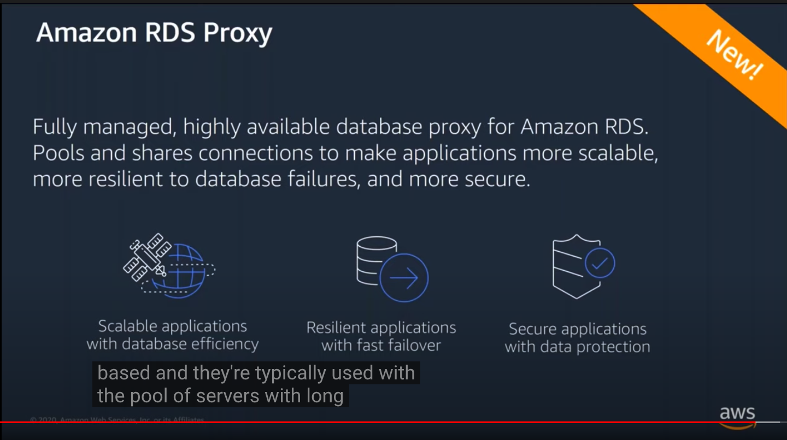
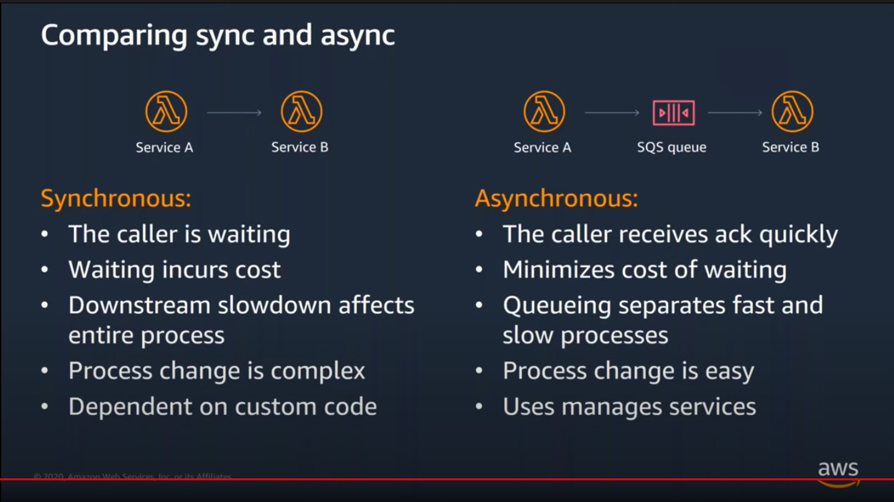

Notes from [Optimizing Lambda Performance for Your Serverless Applications](https://www.youtube.com/watch?v=FTCaOQJvG6Y).

# Lambda overview

Looking at the anatomy of a lambda function we can identify several different layers:

- Your function
- Language runtime
- Execution environment
- Lambda service (invisible to customers, managed by AWS)
- Compute substrate (invisible to customers, managed by AWS)

Apart from well known Lambda runtimes (Node.js, Go etc.), Lambda also supports custom runtimes that you can bring in to Lambda service - so it's possible to use languages like Perl, Erlang and even COBOL.

Lambda itself is agnostic to your choice of runtime and has no preferences for one runtime over another.

Out of 5 layers mentioned earlier, there are only three where our decisions make a difference: function itself, execution environment and Lambda service. It's worth mentioning that AWS is consitently improving the performance of invisible layers as well.

Quick recap of anatomy of an AWS Lambda function:
- Handler function - a function to be executed upon invocation
- Event object - data sent during Lambda function invocation
- Context object - methods available to interact with runtime information (request ID, log group etc.)

There's a difference between a full cold start (e.g. whenever a function is run for the very first time) and a partial cold start (when the execution environment is already running since it stays around for a while):

The first two steps (downloading the code and starting a new execution environment) are optimized by AWS, whereas the last two can be optimized by a developer.

AWS X-Ray allows us to identify areas for performance optimization (X-Ray can both be enabled as an `Active tracing` checkbox in Lambda console, or via the `aws-xray-sdk-core`).

# Optimizing Lambda

## Three areas of performance
- Latency
- Throughput
- Cost

## Latency - cold starts

A Lambda function call always starts with a request to Lambda's API. The next steps depend on whether there is a warm execution environment available.

If there is one, that means that the Lambda function was executed rather recently and the handler can be invoked on that execution environment.

This becomes a bit more complicated if a warm execution environment is not available:

The INIT code is referring to code that is defined outside of the `handler` function.

Cold starts affect less than 1% of production workloads (they are much more common in development environments, since there is way less traffic). A duration of a cold start varies from less than 100ms to more than 1s. It's not possible to 'target' warm environments.

The only actual guarantee of getting a warm environment is using provisioned concurrency, pinging functions to keep the warm will not work when function is scaling out, or the execution environment is being load balanced to a different AZ.

Making function packages as small as possible helps (since there's simply less code to download).

Generally speaking, functions executed more often than others will be hitting warm environments more frequently.

Static initialization is influenced by:
- size of function package
- amount of code
- amount of initialization work (that is - code that runs before the `handler` function)

**The developer is responsible for this part of a cold start**

What can help? Trimming SDKs, reusing DB connections, not loading things we don't need and lazy loading.

If you absolutely need to have warm execution environments, use **Provisioned Concurrency on AWS Lambda** (announced at Re:Invent 2019): 

Provisioned concurrency has a rampup of 500 execution environments per minute (so if you need 5k execution environments it'll take 10 minutes to spin them up).

It's possible to have different provisioned concurrency for different versions of the Lambda function (and remember that it's not possible to use provisioned concurrency for `$LATEST` version).

## Memory and profiling

Lambda exposes only memory control (as it's not possible to modify anything else that influences the 'power' of a Lambda function). The default is 128MB, which is well suited for small Lambda functions, but its definitely possible to save money/time by assigning a larger memory for your function:

AWS Lambda Power Tuning allows the developer to optimize their lambda function from cost/performance perspective without running manual experiments.

## Architecture and best practices

- Avoid "monolithic" functions (optimize package size, micro/nano services)
- Minifiy/uglify production code
- Optimize dependencies and imports
- Lazy initialization of shared libraries/objects

It's better to have a lambda function per purpose rather than one giant Lambda that is essentially `yourBusinessLogic.js`.

In order to solve issues with connections to a relational database, consider using an RDS Proxy:

RDS Proxy (launched at Re:Invent 2019) will intelligently manage your connections to a relational database in RDS. As such, it helps match the way that scalable compute works with traditional database architectures.

In order to reuse existing connections (and improve the performance of functions using `http(s)` request) use `keep-alive` property in order to reuse TCP connections on warm execution environments. More details: https://bit.ly/reuse-connection

## Sync vs. async lambda architectures

