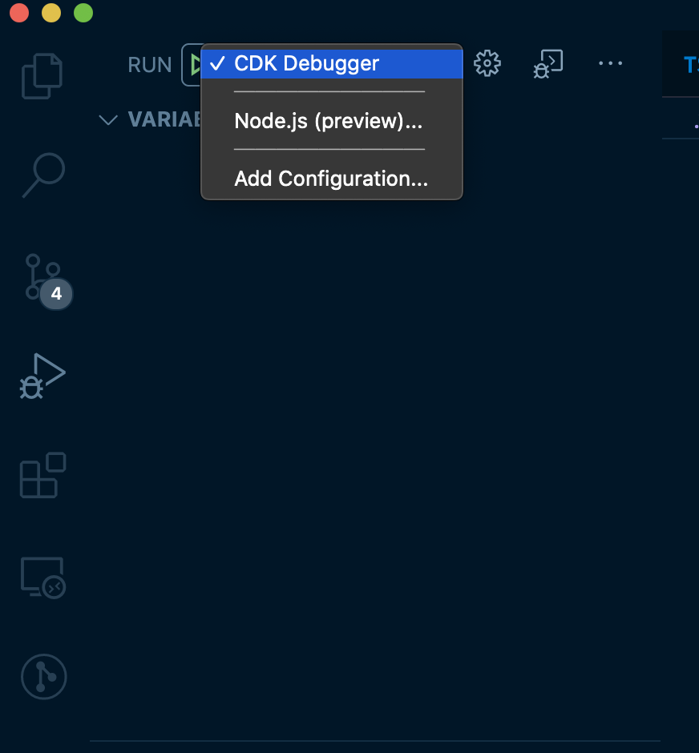
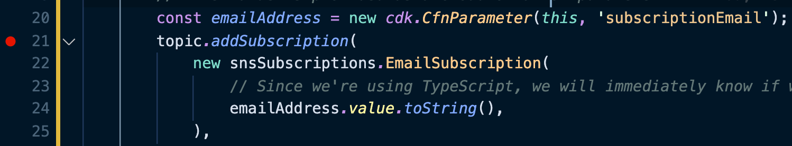
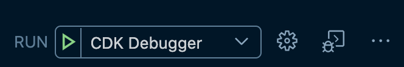
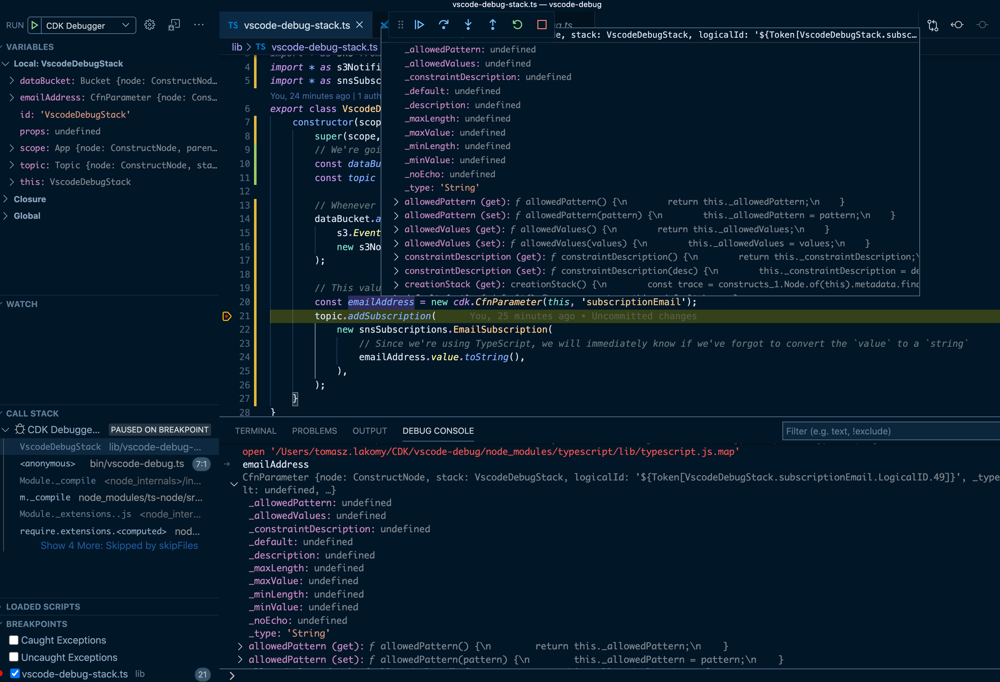

(Before we start - if you've never heard of AWS Cloud Development Kit, I've created a quick, 64 minute course on [egghead.io](https://egghead.io/s/km6vr) - [Build an App with the AWS Cloud Development Kit](https://egghead.io/courses/build-an-app-with-the-aws-cloud-development-kit?af=6p5abz))

This is a quick tip I've learned from [Nathan Glover](https://twitter.com/nathangloverAUS)'s [CDK Debugging in VSCode](https://devopstar.com/2020/02/04/cdk-debugging-in-vscode) blogpost and I'd like to share it further because it may be useful to some of you.

VSCode comes with a [built-in debugger](https://code.visualstudio.com/docs/editor/debugging) which comes in handy whenever you get an unexpected behaviour in your code and you'd like to dig in. Since CDK allows us to use a general purpose programming language (e.g. TypeScript), this VSCode feature can be useful for infrastructure code as well.

Suppose you have a stack like this (taken from my [Build a file upload email subscription with CDK, S3 and SNS](https://tlakomy.com/build-a-s3-sns-email-subscription)) post and you'd like to debug what exactly is the value of `emailAddress` on line 20 (spoiler: it's not a `string`).

```ts
import * as cdk from '@aws-cdk/core';
import * as s3 from '@aws-cdk/aws-s3';
import * as sns from '@aws-cdk/aws-sns';
import * as s3Notifications from '@aws-cdk/aws-s3-notifications';
import * as snsSubscriptions from '@aws-cdk/aws-sns-subscriptions';
export class VscodeDebugStack extends cdk.Stack {
    constructor(scope: cdk.Construct, id: string, props?: cdk.StackProps) {
        super(scope, id, props);
        // We're going to leave everything by default, but you might want to enable versioning on the bucket
        const dataBucket = new s3.Bucket(this, 'DataBucket');
        const topic = new sns.Topic(this, 'Topic');

        // Whenever there's an OBJECT_CREATED event, send a notification to SNS topic
        dataBucket.addEventNotification(
            s3.EventType.OBJECT_CREATED,
            new s3Notifications.SnsDestination(topic),
        );

        // This value is provided as a CloudFormation parameter
        const emailAddress = new cdk.CfnParameter(this, 'subscriptionEmail');
        topic.addSubscription(
            new snsSubscriptions.EmailSubscription(
                // Since we're using TypeScript, we will immediately know if we've forgot to convert the `value` to a `string`
                emailAddress.value.toString(),
            ),
        );
    }
}
```

To do that, first create a `.vscode/launch.json` file with the following content:

```json
{
    "version": "0.2.0",
    "configurations": [
        {
            "type": "node",
            "request": "launch",
            "name": "CDK Debugger",
            "skipFiles": ["<node_internals>/**"],
            "runtimeArgs": [
                "-r",
                "./node_modules/ts-node/register/transpile-only"
            ],
            // Entry point of your stack
            "args": ["${workspaceFolder}/bin/vscode-debug.ts"]
        }
    ]
}
```

(Make sure to replace the `bin/vscode-debug.ts` path with whatever is the main entry of your CDK stack).

This is going to enable a **CDK Debugger** VSCode debug configuration:



Once it's enabled, enable a breakpoint on the line you wish to debug by clicking on the left of the line number:



Everything is ready now, you're free to start the debugger by clicking on the green arrow in the debug panel:



And voila! We're able to debug our CDK stack code without leaving our editor and adding lots of debug `console.log` statements (like every developer does, don't lie):



Notice that it's possible to either take a peek at what's inside of `emailAddress` variable by either hovering over it or by using the VSCode built-in debug console.